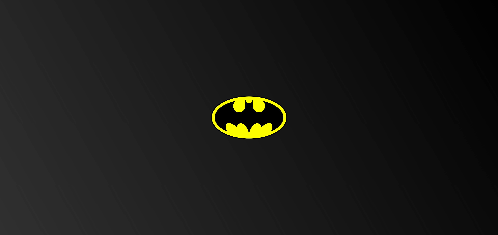

# 🦇 Batman Logo

A simple Batman logo created using HTML and CSS.

## Table of Contents
- [Description](#description)
  - [Modifications](#modifications)
- [Live Demo](#live-demo)
- [Screenshot](#screenshot)
- [Usage](#usage)
- [Project Timeline](#project-timeline)
- [Credits](#credits)
- [License](#license)
- [To-Do](#to-do)

## Description

This project is inspired by a video from the YouTube channel [One Person Studio](https://www.youtube.com/watch?v=iruECu19Nx4) titled "Designing the BATMAN LOGO in HTML and CSS." While following along with the tutorial, I made several modifications to the code, including reducing the number of `div` elements and refactoring the HTML and CSS to improve readability and maintainability.

### Modifications
- Removed two extra `div` elements by modifying CSS properties.
- Grouped common CSS properties and added shared classes (`ovals`, `top-ovals`, `bottom-ovals`, `bottom-outer-ovals`, `bottom-inner-ovals`) to avoid code duplication.
- Added `id` attributes to `div` elements to target specific elements in the CSS.
- Refactored CSS to improve readability and maintainability by organizing properties and using more descriptive class names.

## Live Demo

Check out the live version of this project here: [https://chris-cartaya.github.io/batman-symbol/](https://chris-cartaya.github.io/batman-symbol/).

## Screenshot

## Usage

Feel free to use this project as a reference for your own HTML and CSS projects or as a starting point for further modifications.

## Project Timeline

- **Start Date:** June 29, 2024
- **Completion Date:** July 9, 2024
- **Last Modified:** July 9, 2024

## Credits

- [One Person Studio](https://www.youtube.com/@OnePersonStudioo) for the original inspiration and tutorial.

## License

This project is licensed under the MIT License. See the [LICENSE.md](./LICENSE.md) file for details.

## To-Do

- [ ] Fix the tiny bit of yellow visible on the left side of the logo when zooming in on mobile.
- [ ] Address the faint black line appearing on the "ear" element when zooming in or out.
- [ ] Refactor CSS to improve responsiveness.
